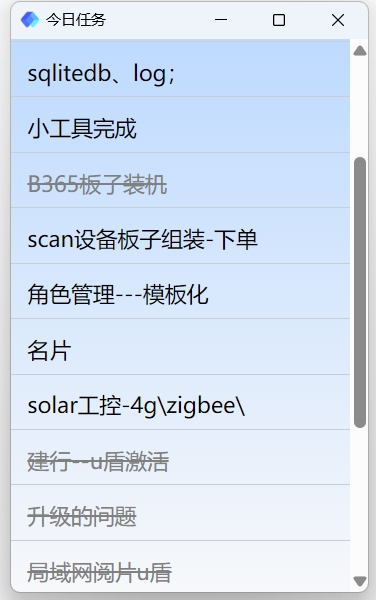
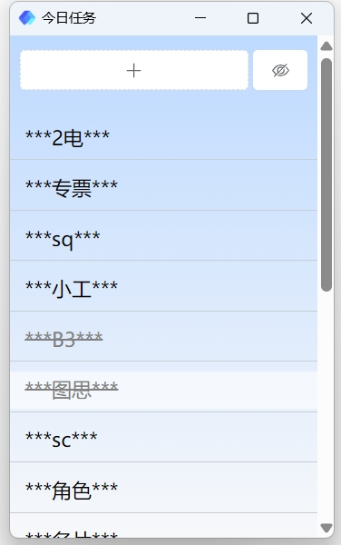

# TODO App Using Wails

## Contacts

```
carlzfq@163.com
```

## 介绍

我一直有一个困扰，我想记录我的代办任务，让代办任务在桌面上，时刻提醒着我；
但是时常有同事到我这讨论问题，他们总会看到我的待办任务，我不想让他们看到。
于是，自己写一个吧，够用就好。

I've always had a concern. I want to keep track of my to-dos and have them displayed on my desktop as a constant reminder. However, my colleagues frequently come by to discuss issues, and they always end up seeing my to-do list, which I’d rather keep private. So, I decided to create one myself—just something that works for my needs.

 

## 环境基础

node
golang
wails

## 构建开发

```
#如果 frontend/wailsjs 目录不存在，先执行如下命令
wails generate module

#如果首次打包提示 dist目录不存在，先执行下面命令
cd frontend
npm i
npm run build

#检测
wails doctor

#调试
wails dev

#调试遇到错误： failed to find Vite server URL，解决办法：通过指定 frontenddevserverurl 参数
wails dev -frontenddevserverurl "http://localhost:8080"

#打包 .exe
wails build
```
